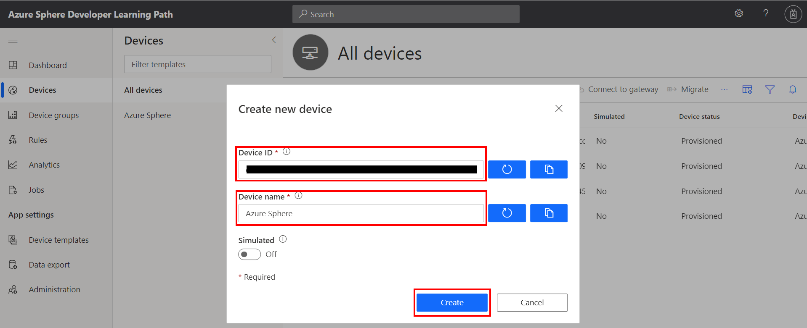
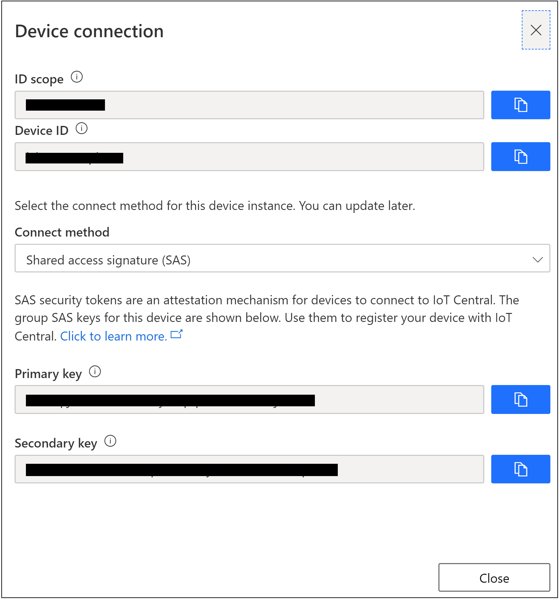
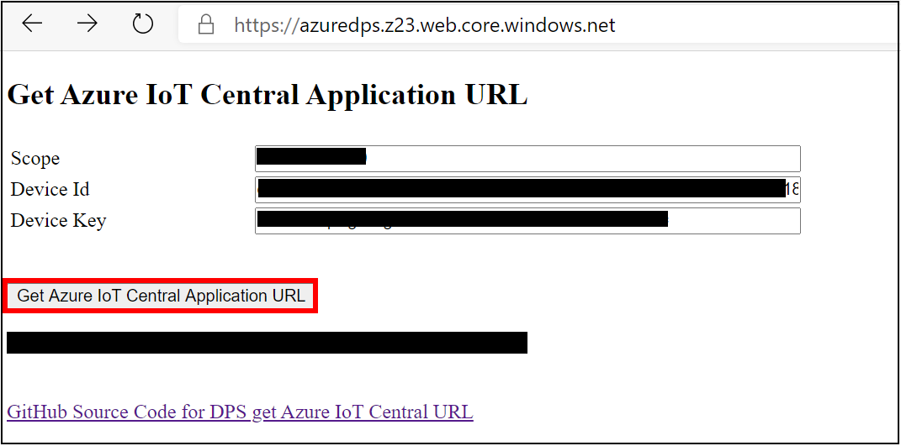

# Lab 2: Send Telemetry from an Azure Sphere to Azure IoT Central

<!--  -->

---

|Author|[Dave Glover](https://developer.microsoft.com/en-us/advocates/dave-glover?WT.mc_id=github-blog-dglover), Microsoft Cloud Developer Advocate, [@dglover](https://twitter.com/dglover) |
|:----|:---|
|Source Code | https://github.com/gloveboxes/Azure-Sphere-Learning-Path.git |
|Date| January  2020|

---

## Azure Sphere Learning Path

Each module assumes you have completed the previous module.

[Home](https://github.com/gloveboxes/Azure-Sphere-Learning-Path/blob/master/README.md)

* Lab 0: [Introduction Azure Sphere and Lab Set Up](/zdocs/Lab_0_Introduction_and_Lab_Set_Up/README.md)
* Lab 1: [Build your first Azure Sphere Application with Visual Studio](/zdocs/Lab_1_Visual_Studio_and_Azure_Sphere/README.md)
* Lab 2: [Send Telemetry from an Azure Sphere to Azure IoT Central](/zdocs/Lab_2_Send_Telemetry_to_Azure_IoT_Central/README.md)
* Lab 3: [Control an Azure Sphere with Device Twins and Direct Methods](/zdocs/Lab_3_Control_Device_with_Device_Twins_and_Direct_Methods/README.md)
* Lab 4: [Integrating FreeRTOS with Azure Sphere Inter-Core Messaging](/zdocs/Lab_4_FreeRTOS_and_Inter-Core_Messaging/README.md)
* Lab 5: [Integrating FreeRTOS with Azure IoT Central](/zdocs/Lab_5_FreeRTOS_and_Azure_IoT_Central/README.md)
* Lab 6: [Mass Device Deployment with Azure IoT Central](/zdocs/Lab_6_Mass_Device_Deployment/README.md)

---

## What you will learn

You will learn how to build a High Level [Azure Sphere](https://azure.microsoft.com/services/azure-sphere/?WT.mc_id=github-blog-dglover) application that connects and sends telemetry to [Azure IoT Central](https://azure.microsoft.com/services/iot-central/?WT.mc_id=github-blog-dglover).

---

## Prerequisites

The lab assumes you understand the content from [Lab 1: Secure, Build, Deploy and Debug your first Azure Sphere High-Level Application with Visual Studio](../Lab_1_Visual_Studio_and_Azure_Sphere/README.md)

## Tutorial Overview

1. Create an Azure IoT Central Application (Free trial)
2. Link your Azure IoT Central to your Azure Sphere Tenant
3. Deploy an Azure IoT Central enabled application to Azure Sphere

---

## Key Concepts

### Azure IoT

Your Azure Sphere device can securely connect and communicate with cloud services. Azure Sphere includes built-in library support for both Azure IoT Hub and Azure IoT Central. This lab focuses on Azure IoT Central.

This project leverages the [Azure IoT Hub Device Provisioning Service (PDS)](https://docs.microsoft.com/en-us/azure-sphere/app-development/use-azure-iot?WT.mc_id=github-blog-dglover) which is included with Azure IoT Central. The Device Provisioning Service (DPS) enables zero-touch, just-in-time, large scale device provisioning.

### Azure IoT Central

[Azure IoT Central](https://azure.microsoft.com/en-in/services/iot-central/?WT.mc_id=github-blog-dglover) provides an easy way to connect, monitor and manage your Internet of Things (IoT) assets at scale.


---

## Getting Started with Azure IoT Central

We are going to create an Azure IoT Central application from an application template.

---

## Step 1: Create an Azure IoT Central Application

For this lab, we are going to create an Azure IoT Central Application from a predefined template.

Right mouse click [Azure Sphere Learning Path Azure IoT Central Template](https://apps.azureiotcentral.com/build/new/107ea05b-c031-4866-a0f3-60c934551ac7) to open in a new browser tab.

### Configure the Azure IoT Central Template

1. Name your application
2. Select the **Free** pricing plan
3. Complete any required fields
4. Click **Create** to create the Azure IoT Central Application.


<!-- When you have connected your Azure Sphere to Azure IoT Central you will be able to visualize the device telemetry.

 -->

<!-- Follow instructions to **[Create an Azure IoT Central Application](resources/azure-iot-central/azure-iot-central.md)** -->

---

## Step 2: Set up Azure IoT Central to work with Azure Sphere

After you have completed the tasks in this section, any device that is claimed by your Azure Sphere tenant will be automatically enrolled when it first connects to your Azure IoT Central application. Therefore, you only need to complete these steps once.

### Download the tenant authentication CA certificate

1. Open an **Azure Sphere Developer Command Prompt**
2. Download the Certificate Authority (CA) certificate for your Azure Sphere tenant:

    ```bash
    azsphere tenant download-CA-certificate --output CAcertificate.cer
    ```

    The output file must have the .cer extension.

### Upload the tenant CA certificate to Azure IoT Central and generate a verification code

1. In Azure IoT Central, go to Administration > Device Connection > Manage primary certificate

2. Click the folder icon next to the Primary box and navigate to the certificate you downloaded in Step 2. If you don't see the .cer file in the list, make sure that the view filter is set to All files (*). Select the certificate and then click the gear icon next to the Primary box.

3. The Primary Certificate dialog box appears. The Subject and Thumbprint fields contain information about the current Azure Sphere tenant and primary root certificate.

4. Click the Refresh icon to the right of the Verification Code box to generate a verification code. Copy the verification code to the clipboard.

    

### Verify the tenant CA certificate

1. Return to the Azure Sphere Developer Command Prompt.

2. Download a validation certificate that proves that you own the tenant CA certificate. Replace code in the command with the verification code from the previous step.

    ```bash
    azsphere tenant download-validation-certificate --output ValidationCertification.cer --verificationcode <code>
    ```
3. The Azure Sphere Security Service signs the validation certificate with the verification code to prove that you own the CA.

### Use the validation certificate to verify the tenant identity

1. Return to Azure IoT Central and click Verify.
2. When prompted, navigate to the validation certificate that you downloaded in the previous step and select it. When the verification process is complete, the Primary Certificate dialog box displays the Verified message. Click Close to dismiss the box.

    

After you complete these steps, any device that is claimed into your Azure Sphere tenant will automatically be accessible to your Azure IoT Central application.

---

## Azure IoT Central Connection Information

For this lab, we are manually creating an Azure Sphere device in Azure IoT Central so we are able to get the Azure IoT Central Application URL.

### Step 1: Create an Azure Sphere Device

1. Start the **Azure Sphere Developer Command Prompt**
2. Run the **```azsphere device show-attached```** command. This returns the Azure Sphere Device Id.
3. Next, run **```powershell -Command ((azsphere device show-attached)[0] -split ': ')[1].ToLower()```**.
This returns the **Device ID** and converts it to lowercase. Azure IoT Central requires device IDs to be lowercase.
4. **Copy** the **Device ID** to the clipboard.

### Step 2: Create an Azure IoT Central Device

1. Switch back to Azure IoT Central Web Portal
2. Select **Devices** from the side menu.
3. Select the **Azure Sphere** device template
    .
4. Click **+ New** to add a new device.
5. Paste the **Device ID** from the PowerShell command into the **Device ID** field.
6. **Name** the Device, for example _Azure Sphere_.
7. Click **Create** to create the new device.

    


### Step 3: Get the Azure IoT Central Application URL

1. Open the newly created device by clicking on the device name.
    
2. Open the Device Connection information panel by clicking on the **Connect** button.
    
3. The device connection configuration will be displayed.
    
4. **Right mouse click** and open the [Azure IoT Central Application URL](https://azuredps.z23.web.core.windows.net) in a **new browser tab**.

5. Copy and paste the **Device Connection** information (Scope, Device Id, and Key) from Azure IoT Central to the **Azure IoT Central Application URL** web page.

6. Click **Get Azure IoT Central Application URL**

    

7. Leave this page open as you will need the Azure IoT Central Application URL soon.

### Step 4: Azure Sphere Tenant ID

1. From the **Azure Sphere Developer Command Prompt**, run **```azsphere tenant show-selected```**.
    * The output of this command will look similar to the following.
        ```text
        Default Azure Sphere tenant ID is 'yourSphereTenant' (99999999-e021-43ce-9999-fa9999499994).
        ```
    * The **Tenant ID** is the numeric value inside the parentheses.
2. **Copy the Tenant ID to _Notepad_** as you will need it soon.

---

## Open Lab 2

### Step 1: Start Visual Studio 2019


### Step 2: Open the lab project

1. Click **Open a local folder**
2. Open the Azure-Sphere lab folder
3. Open the **folder name** that corresponds to the **Azure Sphere board** you are using
4. Open the **Lab_2_Send_Telemetry_to_Azure_IoT_Central** folder
5. Click **Select Folder** button to open the project

### Step 3: Configure the Azure Sphere Application

1. Open the **app_manifest.json** file
    

2. Update the following properties using information from the **Generate Azure IoT Central Application URL** web page:

    * Update **CmdArgs** with your Azure IoT Central **Scope**.
    * Update **AllowedConnections** with your **Azure IoT Central Application URL**.

3. Update **DeviceAuthentication** with your **Azure Sphere Tenant ID**. Remember, this was the numeric value output from the ```azsphere tenant show-selected``` command that you copied to Notepad.

4. **Review** your manifest_app.json file. It should look similar to the following when you have updated it.

    ```json
    {
        "SchemaVersion": 1,
        "Name": "AzureSphereIoTCentral",
        "ComponentId": "25025d2c-66da-4448-bae1-ac26fcdd3627",
        "EntryPoint": "/bin/app",
        "CmdArgs": [ "Fake", "0ne0099999D", "6583cf17-d321-4d72-8283-0b7c5b56442b" ],
        "Capabilities": {
            "Gpio": [ "$AVNET_MT3620_SK_GPIO0", "$AVNET_MT3620_SK_APP_STATUS_LED_YELLOW", "$AVNET_MT3620_SK_WLAN_STATUS_LED_YELLOW" ],
            "Uart": [],
            "I2cMaster": [ "$AVNET_MT3620_SK_ISU2_I2C" ],
            "Adc": [ "$AVNET_MT3620_SK_ADC_CONTROLLER0" ],
            "AllowedConnections": [ "global.azure-devices-provisioning.net", "saas-iothub-99999999-f33a-9999-a44a-7c99999900b6.azure-devices.net" ],
            "DeviceAuthentication": "9d7e79eb-9999-43ce-9999-fa8888888894"
        },
        "ApplicationType": "Default"
    }
    ```

4. **IMPORTANT**. Copy the contents of the **app_manifest.json** file to **notepad** as you will need this configuration information for the next labs.

---

## Build, Deploy and Debug the Azure Sphere Application

Before building the application with Visual Studio ensure ARM-Debug and GDB Debugger (HLCore) options are selected.


### Sending Telemetry to Azure IoT Central

In **main.c**, scroll down to the **MeasureSensorHandler** C Function. In this function there is a call to **SendMsg(msgBuffer);**. This will send the JSON telemetry to Azure IoT Central.

```c
static void MeasureSensorHandler(EventLoopTimer* eventLoopTimer)
{
	if (ConsumeEventLoopTimerEvent(eventLoopTimer) != 0) {
		Terminate();
		return;
	}

	GPIO_ON(builtinLed); // blink send status LED

	if (ReadTelemetry(msgBuffer, JSON_MESSAGE_BYTES) > 0) {
		Log_Debug("%s\n", msgBuffer);
		SendMsg(msgBuffer);
	}

	GPIO_OFF(builtinLed);
}
```

### Start the Azure Sphere Application

To start the build, deploy, debug process, either click the Visual Studio **Start Selected Item** icon or press **<kbd>F5</kbd>**. To Build and deploy without attaching the debugger, simply press **<kbd>Ctrl+F5</kbd>**.


<!-- ---

## Migrate your device to an Azure IoT Central Template

1. Open the Azure IoT Central Application you created.
2. Open the **Devices** tab. **You will need to wait a minute or two before the new device listed. It will have a numeric name.**
This numeric name is the ID of your Azure Sphere Device. You can check this by running the  ```azsphere device show``` command from the *Azure Sphere Command Prompt*.
4. Select this new device and click **Migrate**
    
5. Migrate the Azure Sphere device to the **Azure Sphere** Template
     -->

---

## View Device Telemetry on the Azure IoT Central Dashboard

1. Switch back to Azure IoT Central in your web browser.
2. Ensure your device is selected.
3. Ensure the **Overview** tab is selected.
4. You need to wait a minute or two before the telemetry is displayed on the **Overview** tab.


## Close Visual Studio

Now close **Close Visual Studio**.

---

## Finished 完了 fertig finito ख़त्म होना terminado

Congratulations you have finished Lab 2.


---

**[NEXT](../Lab_3_Control_Device_with_Device_Twins_and_Direct_Methods/README.md)**

---
